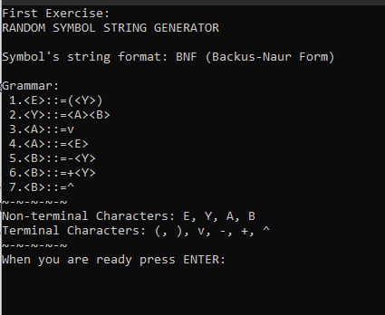
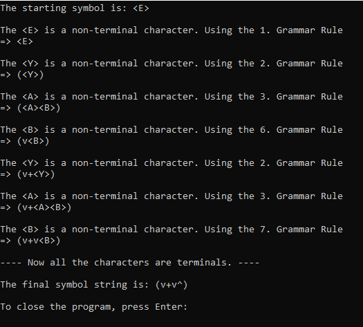
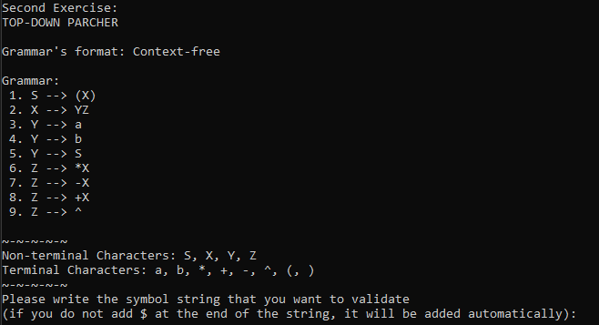
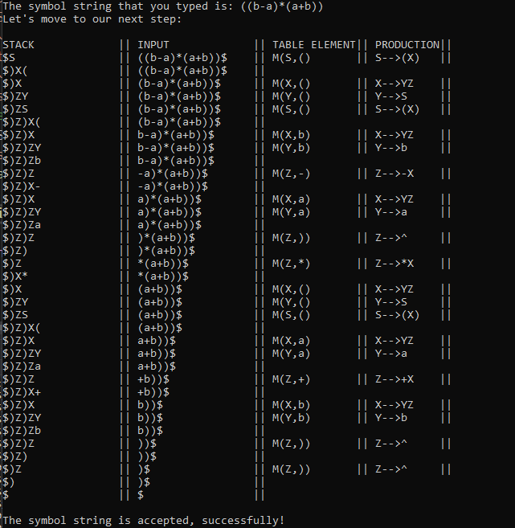
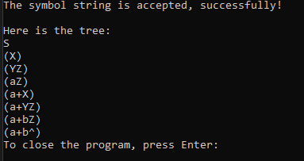
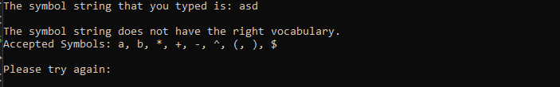
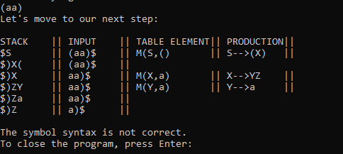
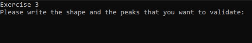
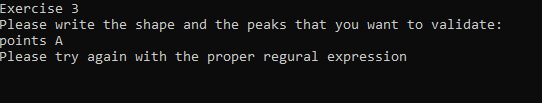
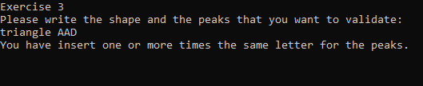

# Compilers (2021) - Final Assignment

## Project Overview

This project is a team assignment for the "Compilers" course, offered in the 3rd semester of the 2021 academic year at the University of Piraeus, Department of Informatics. The project consists of three distinct tasks, each focusing on different aspects of compiler design and implementation. The tasks were developed in C/C++ and Flex, and were aimed at demonstrating skills in string generation, syntax analysis, and lexical analysis. The tasks are:

- **Thema 1:** String Generator
- **Thema 2:** Top-Down Parser
- **Thema 3:** Flex-based Analyzer

## Course Information

- **Institution:** [University of Piraeus](https://www.unipi.gr/en/)
- **Department:** [Department of Informatics](https://cs.unipi.gr/en/)
- **Course:** Compilers (2021)
- **Semester:** 3rd

## Technologies Used

- C++
- C
- Flex


## Tasks Details

### Thema 1: String Generator

#### Description:

Design and implement a string generator for the following grammar:

```
<E>::=(<Y>)
<Y>::=<A><B>
<A>::=ν|<E>
<B>::=-<Y>|+<Y>|ε
```

#### Requirements

- Ensure the process terminates.
- The program should print each step of the production.

### Thema 2: Top-Down Parser

#### Description

Implement a top-down parser for the following grammar:

```
S→(Χ)
Χ→ΥΖ
Υ→α | β | S
Ζ→*Χ | -Χ | +Χ | ε
```

#### Requirements

The parser should:
- Recognize valid strings.
- Return and print the corresponding syntax tree.
- Demonstrate the parser using the expression `((β-α)*(α+β))`.

### Thema 3: Flex-based Analyzer

#### Description

Implement a Flex program that analyzes sentences in a subset of natural language, specifically identifying correct definitions of points, lines, triangles, etc., up to octagons.

#### Requirements:

- Accept only correct definitions, such as "triangle BCD" or "square BCDA".
- Reject incorrect definitions, such as "square AB" or "triangle AAD".

## Usage Examples

### Thema 1: String Generator

When the user runs the executable file, they will be greeted with the following screen:



**Note:** To make the empty symbol visible in the terminal, we decided to represent it as “^” instead of “ε” or a space.

By pressing the Enter key, the generation algorithm begins, printing the steps in the terminal as it progresses until the string contains only terminal symbols.



### Thema 2: Top-Down Parser

When the user runs the executable file, they will be greeted with the following screen:



**Note:** To make the empty symbol visible in the terminal, we decided to represent it as “^” instead of “ε” or a space.

The user is prompted to enter a string for recognition:

Suppose the user inputs the string `((ba)*(a+b))`.



The program will then inform the user whether the string is accepted or not and will print the parse table and the corresponding parse tree.



To terminate the program, the user must press the Enter key.

If the user enters an incorrect string:



Or if the user inputs a string with valid symbols but syntactically incorrect:



### Thema 3: Flex-based Analyzer

When the file is executed, the following will appear in the terminal:



If the user completely misinputs the data, the program will display a message prompting the user to enter another valid regular expression.



In the case where the user inputs two or more vertices with the same name.



If the user inputs correctly and the program executes as expected.


## Setup Instructions

### Prerequisites

Before running the programs, ensure that you have the following installed on your system:

- **C++ Compiler** (g++ for Windows/Linux/MacOS)
- **Flex Compiler** (for `thema3.l`)

### Setting Up and Running the Programs

#### Thema 1: Compiling and Running the C++ Program (`thema1.cpp`)

1. **Install a C++ Compiler:**
   - **Windows:**
     - Install [MinGW](https://sourceforge.net/projects/mingw/). During installation, select the checkbox to install the C++ compiler.
   - **MacOS/Linux:**
     - Most systems come with g++ pre-installed. If not, you can install it via Homebrew (MacOS) or your package manager (Linux).

2. **Configure the Environment (Windows Only):**
   - Add the path to the MinGW `bin` directory to your system’s environment variables:
     - Go to `Advanced System Settings` → `Environment Variables` → `User Variables` → `Path` → `New`.
     - Add the path (e.g., `C:\MinGW\bin`).

3. **Compile the Program:**
   - Navigate to the directory containing `thema1.cpp` in your terminal or command prompt.
   - Run the following command:
     ```bash
     g++ thema1.cpp -o thema1
     ```
     This will create an executable file named `thema1` (or `thema1.exe` on Windows).

4. **Run the Program:**
   - **Windows:**
     ```bash
     thema1.exe
     ```
   - **MacOS/Linux:**
     ```bash
     ./thema1
     ```

You can follow the same instructions for thema 2.

#### Thema 3: Compiling and Running the Flex Program (`thema3.l`)

1. **Install the Flex Compiler:**
   - **MacOS/Linux:**
     - For MacOS, install Flex using Homebrew:
       ```bash
       brew install flex
       ```
     - For Linux, use your package manager:
       ```bash
       sudo apt-get install flex
       ```
   - **Windows:**
     - Download and install [GnuWin32 Flex](http://gnuwin32.sourceforge.net/packages/flex.htm).
     - During installation, ensure the Flex compiler is selected.
     - Add the path to the GnuWin32 `bin` directory (e.g., `C:\GnuWin32\bin`) to your system’s environment variables.

2. **Compile the Flex Program:**
   - Navigate to the directory containing `thema3.l` in your terminal or command prompt.
   - Run the following commands:
     ```bash
     flex thema3.l
     gcc lex.yy.c -o thema3
     ```
     This will create an executable named `thema3` (or `thema3.exe` on Windows).

3. **Run the Program:**
   - **Windows:**
     ```bash
     thema3.exe
     ```
   - **MacOS/Linux:**
     ```bash
     ./thema3
     ```

## Contributors

<table>
  <tr>
    <td align="center"><a href="https://github.com/thkox"><br /><sub><b>Theodoros Koxanoglou</b></sub></a><br /></td>
    <td align="center"><a href="https://github.com/ApostolisSiampanis"><br /><sub><b>Apostolis Siampanis</b></sub></a><br /></td>
    <td align="center"><a href="https://github.com/AimiliosKourpas"><br /><sub><b>Aimilianos Kourpas</b></sub></a><br /></td>
  </tr>
</table>

## License

This project is licensed under the MIT License - see the [LICENSE](./LICENSE) file for details.
